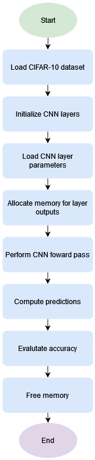

# Υλοποίηση σειριακού κώδικα

## Φόρτωση εικόνων CIFAR-10

Αρχικά διαβάζουμε τα

## Υλοποίηση Επιπέδων

### Αρχιτεκτονική Δικτύου

Karpathi - Convjs

* structs
* make layers
* forward 
    * Convolution
    * ReLU
    * Pooling
    * Fully Connected
    * Softmax
* free layers
* load parameters
    * Snapshot

## Κυρίως πρόγραμμα


Memory allocations

Net Forward

Calculate Net Results and Accuracy

Free memory allocated
### Variables:

* `labels`: Array to store image labels.
input: 2D array to store image data.
* `L1, L2, ..., L11`: Pointers to different types of network layers (Conv_Layer, ReLU_Layer, Pool_Layer, FC_Layer, Softmax_Layer).
* `O1, O2, ..., O11`: Pointers to outputs of each layer.
* `predictions`: Array to store predicted labels.

### Layer Structures

### Layer Functions

Υπολογισμός των δεικτών της εισόδου Χ στο εσωτερικό loop, ώστε τα υπόλοιπα loop να είναι πιο απλά για παραλληλοποίηση
Όμοια και στην pool_forward.

```c
void conv_forward(float* restrict X, Conv_Layer* l, float* restrict Y) {

    for (int m = 0; m < l->out_depth; m++) {
        for (int j = 0; j < l->out_height; j++) {
            for (int i = 0; i < l->out_width; i++) {
                int y_idx = i + (l->out_width * (j + m * l->out_height));
            
                float sum = l->bias[m];
                for (int c = 0; c < l->in_depth; c++) {
                    for (int f_j = 0; f_j < l->filter_width; f_j++) {
                        for (int f_i = 0; f_i < l->filter_width; f_i++) {
                            int f_idx = f_i + (f_j * l->filter_width) + (c + m * l->in_depth) * (l->filter_width * l->filter_width);
                            int x_j = -l->padding + j * l->stride + f_j;                                                            
                            int x_i = -l->padding + i * l->stride + f_i;                                                            
                        
                            if (x_j >= 0 && x_i >= 0 && x_j < l->in_height && x_i < l->in_width) {
                                int x_idx = c * l->in_height * l->in_width + x_j * l->in_width + x_i;
                                sum += l->weights[f_idx] * X[x_idx];
                            }
                        }
                    }
                }
                Y[y_idx] = sum;
            }
        }
    }
}
```
