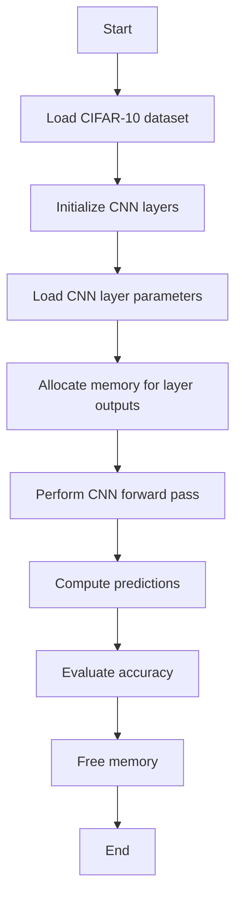

The flowchart includes the following steps:

1. **Load CIFAR-10 dataset**: Load the input images and labels from the CIFAR-10 dataset.
2. **Initialize CNN layers**: Create and initialize the CNN layers, including convolutional, ReLU, pooling, fully connected, and softmax layers.
3. **Load CNN layer parameters**: Load the pre-trained parameters for the CNN layers.
4. **Allocate memory for layer outputs**: Allocate memory to store the outputs of each CNN layer.
5. **Perform CNN forward pass**: Execute the forward pass of the CNN by applying the layers sequentially to the input images.
6. **Compute predictions**: Determine the predicted class for each input image based on the output of the softmax layer.
7. **Evaluate accuracy**: Compute the overall accuracy of the CNN by comparing the predicted classes to the ground truth labels.
8. **Free memory**: Free the memory allocated for the CNN layers and their outputs.
9. **End**: Terminate the program.

This flowchart provides a high-level overview of the main steps involved in the code, making it easier to understand the overall logic and flow of the CNN implementation.
